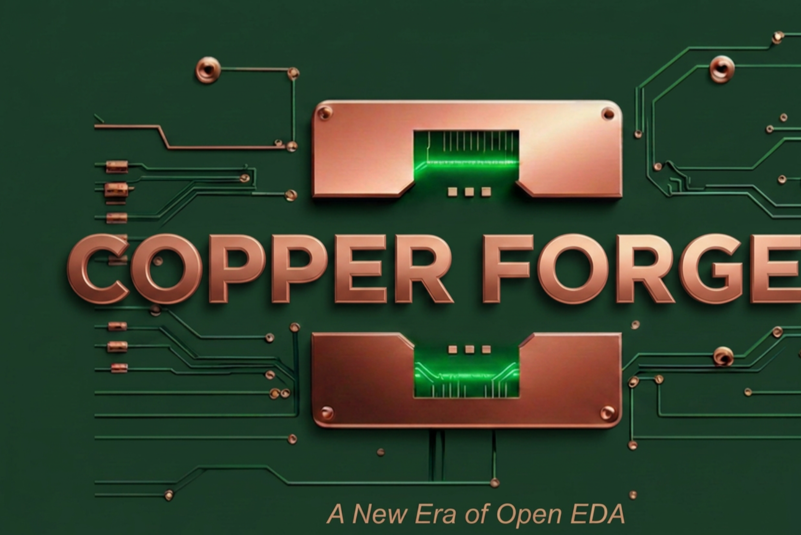
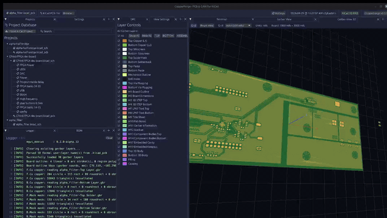

<div align="center">
</img>

PCB release & manufacturing companion for KiCad.

[](https://github.com/emilk/egui)
[](https://www.kicad.org/)
[](https://www.rust-lang.org/)
[](https://opensource.org/licenses/MIT)

</div>

---

<div align="center">

</div>

## What it does

Generate KiCad gerbers, view them in 2D and 3D, export BOM and centroid, run vendor DRC, and
package tagged release zips — from one app, with per-project revision history.

- **Release packaging.** One click produces `outputs/<rev>/<project>_<rev>[_<date>].zip`
  with gerbers, drills, BOM (CSV + XLSX), centroid (CPL), and a `RELEASE_NOTES.md`
  capturing the KiCad version, host OS, and git commit at release time. PCBWay-target
  releases additionally bundle a fab-specs sheet (board dimensions, SMT/THT part and pad
  counts).
- **Gerber viewers.** A 2D viewer (grid, ruler, manual origin, mirror, layer presets,
  per-layer color) and a 3D viewer (board outline, copper, soldermask) — both running on
  the same parsed layer data.
- **BOM & centroid.** Pulled directly from `.kicad_pcb` via `kiparse`, no live IPC to
  KiCad required. BOM is symbol-library enriched (Manufacturer, MPN, datasheet); centroid
  follows the PCBWay / JLCPCB CPL convention.
- **DRC with vendor presets.** Pick a fab (Advanced Circuits, JLCPCB, or a Conservative
  default) and the trace/space and clearance rules load in one click. A custom editor
  handles in-house rules.
- **Project database.** Embedded [redb](https://github.com/cberner/redb) tracks every
  imported project, BOM snapshot, and release. On-disk releases that the database loses
  are rediscovered and reattached on next load.
- **KiCad 10 ready.** Detects `kicad-cli` installed via PATH, Flatpak, or Snap (cached
  after first launch). Reads both KiCad 10's `--no-protel-ext` filenames and the
  traditional / Protel patterns.

## Two distributions

CopperForge ships as a **wasm browser app** at [copperforge.dev](https://copperforge.dev)
and as a **native desktop app** (Linux / macOS / Windows). Both targets share the same
Rust core in `crates/copperforge-core/`, so gerber rendering, BOM and centroid parsing,
release packaging, and PCBWay export behave identically where features overlap.

### 1. Browser — [copperforge.dev](https://copperforge.dev)

Click **📂 Load Example** for a bundled 4-layer FPGA dev board, or upload your own
CopperForge release zip. The 2D viewer, Board stats panel, and PCBWay re-export all
work client-side — nothing leaves your browser.

What's in the browser today: 2D gerber viewer (grid, ruler, mirror, origin, layer
presets, color picker), board stats (dimensions, component counts, SMT pads, weight
estimate), BOM and centroid display, Release / Release-for-PCBWay download.

What's desktop-only: gerber **generation** (needs `kicad-cli`, native binary),
direct `.kicad_pcb` parsing (BOM and centroid are read from the uploaded zip instead),
the project database, and the 3D viewer.

### 2. Desktop

Full feature set: gerber generation, 2D and 3D viewers, BOM and centroid export, DRC,
release packaging, project database. Prebuilt binaries, no Rust toolchain required:

```bash
curl --proto '=https' --tlsv1.2 -LsSf \
  https://github.com/Atlantix-EDA/CopperForge/releases/latest/download/copperforge-installer.sh | sh
```

`x86_64` / `aarch64` Linux, `x86_64` / `aarch64` macOS, and `x86_64` Windows are published
to [Releases](https://github.com/Atlantix-EDA/CopperForge/releases) on every tagged version
with SHA-256 checksums alongside.

#### Build from source

Requires Rust 1.88+.

```bash
git clone https://github.com/Atlantix-EDA/CopperForge.git
cd CopperForge
cargo run --release
```

## Status

Under active development. The release workflow, 2D and 3D viewers, BOM and centroid export,
PCBWay-target release, DRC, and the project database are shipping. In-progress and planned
work (multi-rev diff, more vendor packaging, expanded DRC) lives in the issues.

## Architecture

Native [egui](https://github.com/emilk/egui) application sharing its core with a wasm browser
build. Both targets compile from `crates/copperforge-core/`.

| | |
|---|---|
| UI | egui 0.33, eframe 0.33, egui_dock 0.18 |
| Gerber | gerber-viewer, gerber-parser, gerber-types |
| BOM parsing | [kiparse](https://github.com/Atlantix-EDA/atlantix-eda) |
| Storage | redb (single-file embedded KV) |
| Release archive | zip (deflate), rust_xlsxwriter |
| Browser target | wasm32 via Trunk + eframe WebRunner |

## Credits

- 3D viewer adapted from [alumina-interface](https://github.com/timschmidt/alumina-interface)
  by Timothy Schmidt (MIT) — the OpenGL renderer behind CopperForge's `render3d` module.
- Gerber rendering builds on [gerber-viewer](https://github.com/MakerPnP/gerber-viewer) from
  the MakerPnP project.

## License

MIT.
</content>
