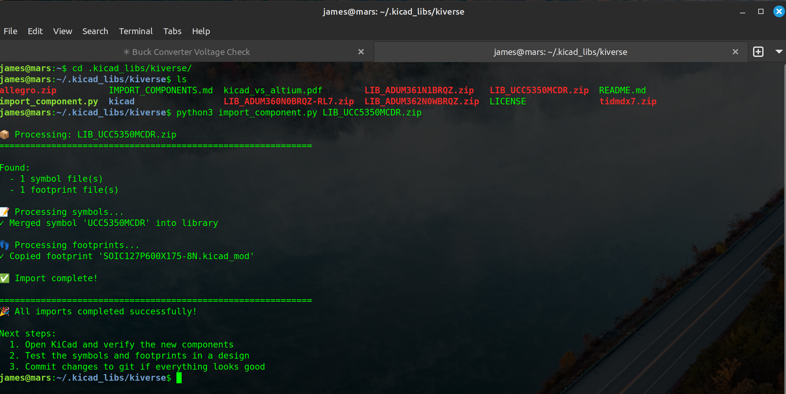

<div align="center">
</img>

## *Professional PCB Design Workflow Platform for KiCad*

[](https://github.com/emilk/egui)
[](https://www.kicad.org/)
[](https://blog.rust-lang.org/2022/11/03/Rust-1.65.0.html)
[](https://opensource.org/licenses/MIT)

</div>

**CopperForge** is a comprehensive desktop application that transforms KiCad into a professional-grade PCB design platform. It bridges the gap between schematic capture and manufacturing by providing integrated project management, curated component libraries, real-time BOM analysis, and advanced visualization—all in a modern, memory-safe Rust application.

> **The Vision:** Altium Designer workflow efficiency with KiCad's open-source freedom.

## Features

Traditional KiCad workflows involve tedious manual library management, disconnected tools for BOM generation, and separate gerber viewers. CopperForge eliminates these pain points by providing:

- **Turnkey Project Creation** - New KiCad projects configured in seconds
- **Curated Component Libraries** - E96 resistors (0402-2512) + extensive IC library pre-installed
- **One-Command Component Import** - Download from Digi-Key/Mouser → import in 30 seconds
- **Real-time BOM** - Live bill of materials while you design
- **Integrated Gerber Preview** - Manufacturing output visualization without leaving your workflow
- **Professional Project Management** - Version tracking, metadata, and organization

## The CopperForge Ecosystem

CopperForge integrates multiple specialized repositories into a cohesive platform:

```
┌─────────────────────────────────────────────────────────────┐
│                      CopperForge Core                       │
│         Project Management • KiCad Integration              │
│              Workflow Automation • UI Framework             │
└──────────────┬──────────────────────────────┬───────────────┘
               │                              │
    ┌──────────▼───────────┐        ┌─────────▼──────────┐
    │  Component Libraries │        │  Analysis & Viz    │
    │  • atlantix-eda      │        │  • gerber_parser   │
    │  • kiverse           │        │  • gerber_viewer   │
    │  • Import Pipeline   │        │  • BOM extraction  │
    └──────────────────────┘        └────────────────────┘
```

### Component Libraries
- **[atlantix-eda](https://github.com/Atlantix-EDA/atlantix-eda)**: Precision E96 resistor library (0402, 0603, 0805, 1206, 1210, 2512 packages)
- **[kiverse](https://github.com/Atlantix-EDA/kiverse)**: Comprehensive IC component library with automated import tooling

### Visualization & Analysis
- **gerber_types**, **gerber_parser**, **gerber_viewer**: Multi-layer manufacturing visualization (from MakerPnP project)
- **egui_mobius** + **egui_lens**: Reactive state management and modern UI framework
- **kicad-ecs**: IPC communication for real-time KiCad integration

## Killer Feature: 30-Second Component Import

**Traditional way:** 20-40 minutes of manual symbol/footprint editing per component
**CopperForge:** One command, 30 seconds, works globally across all projects

```bash
python3 ~/kiverse/import_component.py ADUM360N0BRQZ-RL7.zip
```

Auto-extracts symbols, footprints, and updates library tables. Supports Digi-Key, Mouser, SamacSys, and any KiCad-format archives.



## Demo: Complete Workflow


**What you're seeing:**
- PCB design with 400+ components loaded
- Gerbers generated in-tool
- Real-time visualization
- Smooth, responsive UI at 60 FPS

## Requirements

- **Rust**: 1.65.0 or higher ([rustup.rs](https://rustup.rs/))
- **KiCad**: 9.0+ (for PCB integration)
- **Operating System**: Linux, macOS, or Windows
- **just**: Command runner ([install](https://github.com/casey/just))

## Quick Start

```bash
# 1. Clone CopperForge
git clone https://github.com/Atlantix-EDA/CopperForge.git
cd CopperForge

# 2. Setup component libraries (one-time)
cargo install just
just setup-libraries  # Clones kiverse to ~/kiverse

# 3. Launch
just run
```

### Essential Workflows

**Create a New KiCad Project:**
1. Projects tab → "➕ New Project" → "🆕 Create New KiCad Project"
2. Fill in name, location, author - libraries auto-configured with KiVerse + Atlantix resistors
3. Open in KiCad: `kicad ~/your-project/your-project.kicad_pro`

**Import a Component (30 seconds vs. 30 minutes manual):**
```bash
# Download component zip from Digi-Key/Mouser/SamacSys
python3 ~/kiverse/import_component.py ADUM360N0BRQZ-RL7.zip
# Done. Available in all KiCad projects immediately.
```

**Live BOM:** KiCad PCB open → CopperForge BOM tab → "Connect"

**Gerber Preview:** CopperForge → Open gerber files → verify layers

## Architecture

CopperForge is built with modern Rust best practices:

- **Memory Safety**: Zero-cost abstractions with Rust's ownership model
- **Multi-threading**: Parallel gerber processing and BOM updates
- **Reactive UI**: egui with signal/slot pattern for responsive experience
- **Modular Design**: Clean separation between core, UI, and integration layers
- **IPC Communication**: Real-time KiCad integration via Unix sockets

## Roadmap

**Current:** Project management, global libraries, component import, live BOM, gerber viewer
**Next:** Enhanced DRC, LibrePCB support, P&P export, cost tracking
**Future:** Collaboration, cloud sync, AI component recommendations, panelization

See [ROADMAP.md](./ROADMAP.md) for details.

## Contributing

We welcome contributions! CopperForge is built by the community, for the community.

**Ways to contribute:**
- 🐛 Report bugs and request features via GitHub Issues
- 💻 Submit pull requests (see [CONTRIBUTING.md](./CONTRIBUTING.md))
- 📚 Improve documentation
- 🎨 Design UI/UX improvements
- 📦 Add components to kiverse library
- ⭐ Star the repo and share with your network!

## Related Projects

- **[atlantix-eda](https://github.com/Atlantix-EDA/atlantix-eda)** - E96 resistor library
- **[kiverse](https://github.com/Atlantix-EDA/kiverse)** - IC component library
- **[KiCad](https://www.kicad.org/)** - The excellent open-source EDA suite we enhance

## License

MIT License - See LICENSE file for details.

---

<div align="center">

[⭐ Star on GitHub](https://github.com/Atlantix-EDA/CopperForge) • [📖 Documentation](./docs) • [🐛 Report Bug](https://github.com/Atlantix-EDA/CopperForge/issues)

</div>
